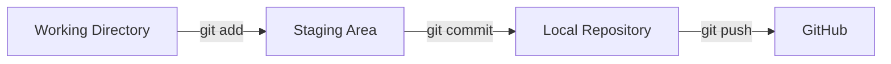

"TDE1" 

# Fluxo do Git - TDE

```mermaid
graph LR
    A[Working Directory] -- git add --> B[Staging Area]
    B -- git commit --> C[Local Repository]
    C -- git push --> D[GitHub]
```
*Diagrama 1: Controle de versão com Git.*